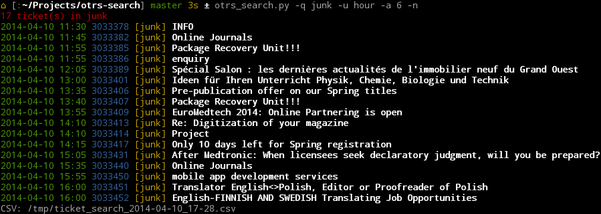

Command Line search for OTRS 2.x/3.x
==================================

Command line search script for the OTRS 2.x/3.x ticketing system, using https resquests in python. Password is encrypted with GnuPG.

DEPENDENCIES
------------

- Python 2.6/2.7 (not compatible with Python 3)
- PyMe (gpgme wrapper) http://pyme.sourceforge.net/
- Python BeautifulSoup http://www.crummy.com/software/BeautifulSoup/
- Python Arrow

INSTALLATION
------------

- Install dependencies, on Debian/Ubuntu:

```
sudo apt-get install python-pyme python-setuptools gnupg python-pip
sudo pip install arrow beautifulsoup
```

- You must have a GPG key to create the password file

    ```gpg --gen-key```

- Install the script and configure it with:

    ```sudo ./setup.py install```

FEATURES
--------

- Full text search
- Search by: id, client, operator, queues
- Time units and amount support (year, month, ...)
- English and French supported
- URL shortener using goog.gl (with token support)
- GPG encrypted password file
- Authenticate once until reboot (uses session cookie)
- Tested on OTRS 2.3.4, 2.4.9, 3.1.11, 3.2.8, and 3.3

EXAMPLES
--------

```
./otrs_search.py --client dupont
./otrs_search.py --id 1234567
./otrs_search.py term1 AND term2
./otrs_search.py 'term1&&term2'
./otrs_search.py 'term1||term2'
./otrs_search.py -u year -a 3 'term1'
./otrs_search.py -q SomeQueue

# Last hour tickets, last first, showing only hour and no link
watch -c -n 30 "otrs_search.py -a 1 -n -r -f ' HH:mm ' -t"
```



TODO
----

- Fix plaintext password ?
- Fix setup.py in root with gpg key
- Search by: state
- Use filename in header to save CSV file
- More stuff in configuration file

CHANGELOG
---------

- 08.11.11 JBA Creation du script, recherche basique
- 09.11.11 JBA Gestion des sessions 
- 16.11.11 JBA Search by Ticket ID or client email 
- 18.11.11 JBA Config is in a separate file, ready for publishing
- 22.11.11 JBA No google url shortener links option, missing translation
- 12.11.11 JBA Faster: do not check session with http but relying on session file.
- 20.12.11 JBA Reverse result option
- 12.01.12 JBA Add colored ticket state
- 13.01.12 JBA Support English !!!
- 13.02.12 JBA Add setup.py script for easier installation
- 31.10.12 JBA Filter by queque, list queques
- 02.11.12 JBA Add queue partial name matching
- 07.11.12 JBA Search by client id
- 16.01.13 JBA Add -n switch to hide URL
- 02.2014  JBA Add -t, -f switches

LICENSE
-------

```
Copyright (C) 2011-2014 Jean-Baptiste Aubort <jean-baptiste.aubort@epfl.ch>

This program is free software; you can redistribute it and/or modify it
under the terms of the GNU General Public License as published by the
Free Software Foundation; either version 3 of the License, or any later
version. This program is distributed in the hope that it will be useful,
but WITHOUT ANY WARRANTY; without even the implied warranty of
MERCHANTABILITY or FITNESS FOR A PARTICULAR PURPOSE.  See the GNU General
Public License for more details. You should have received a copy of the
GNU General Public License along with this program; if not, write to the
Free Software Foundation, Inc., 51 Franklin Street, Fifth Floor, Boston, MA 02110-1301  USA
```

See gpl-3.0.txt

